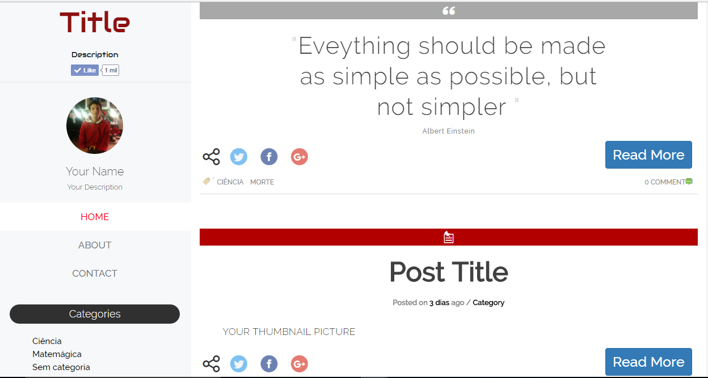

# GirinoTheme

  A beautiful and professional theme for WordPress

## Motivation

  It is my first WordPress experience and I am very excited about that. I created this theme especially for my brother, who is a blogger. He is using my theme right now. Check it out: http://quasecientista.com.br/.

## Installation

After the Installation of WordPress. You have to follow these steps:

  • Download GirinoTheme and copy the folder to '/Themes' in your WordPress folder.

  • Go to your DashBoard on WordPress click in "Appearance" and select GirinoTheme.

  • Go to Girino Menu Bar and customize the options yourself such as: upload your profile picture, active post formats and upload the twitter and Facebook accounts of your page

  • Have Fun!

## Contributors

  • Marcelo Gennari do Nascimento

  • http://www.alecaddd.com/about-alessandro-castellani-designer-developer/

## What's next
• Fix bugs.

• Optimize the code.

• Improve the ReadMe document.
## License
GNU General Public License v2 or later: http://www.gnu.org/licenses/gpl-2.0.html
